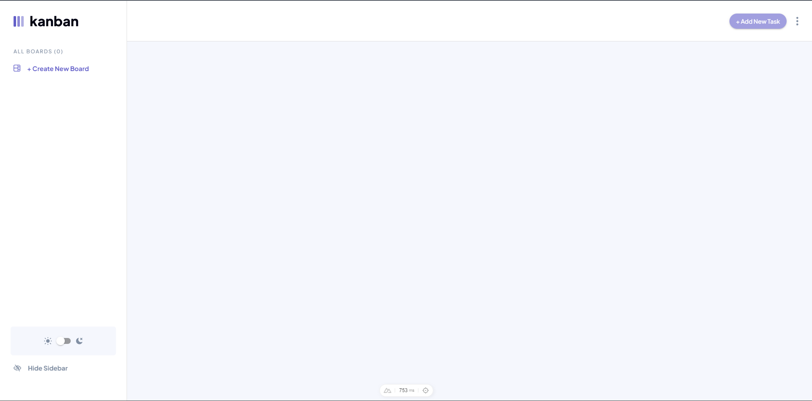

# Frontend Mentor - Kanban task management web app solution

This is a solution to the [Kanban task management web app challenge on Frontend Mentor](https://www.frontendmentor.io/challenges/kanban-task-management-web-app-wgQLt-HlbB). Frontend Mentor challenges help you improve your coding skills by building realistic projects.

## Table of contents

- [Frontend Mentor - Kanban task management web app solution](#frontend-mentor---kanban-task-management-web-app-solution)
  - [Table of contents](#table-of-contents)
  - [Overview](#overview)
    - [The challenge](#the-challenge)
    - [Screenshot](#screenshot)
    - [Links](#links)
    - [Built with](#built-with)
  - [Author](#author)
  - [essentials](#essentials)
    - [Setup](#setup)
    - [Development Server](#development-server)
    - [Production](#production)

## Overview

### The challenge

Users should be able to:

- View the optimal layout for the app depending on their device's screen size
- See hover states for all interactive elements on the page
- Create, read, update, and delete boards and tasks
- Receive form validations when trying to create/edit boards and tasks
- Mark subtasks as complete and move tasks between columns
- Hide/show the board sidebar
- Toggle the theme between light/dark modes
- **Bonus**: Allow users to drag and drop tasks to change their status and re-order them in a column
- **Bonus**: Keep track of any changes, even after refreshing the browser (`localStorage` could be used for this if you're not building out a full-stack app)

### Screenshot



### Links

- Solution URL: [Add solution URL here](https://github.com/Wong0790/kaban-task-management)
- Live Site URL: [Add live site URL here](https://app.netlify.com/sites/wong0790-kaban-task-management/overview)

### Built with

- Semantic HTML5 markup
- Tailwind-CSS custom properties
- Flexbox
- CSS Grid
- Mobile-first workflow
- [Vuetify](https://vuetifyjs.com/) - Vue component framework
- [Vuelidate](https://vuelidate-next.netlify.app/) - For validations
- [Tailwindcss](https://tailwindcss.com/) - For styles
- [Pinia](https://pinia.vuejs.org/) - For state management

## Author

- Website - [Anneris Eloisa Wong Jorge](https://www.your-site.com)
- Frontend Mentor - [@Wong0790](https://www.frontendmentor.io/profile/Wong0790)
- Linkedin - [Anneris Wong Jorge](https://www.linkedin.com/in/anneris-wong-jorge-257948104)

## essentials

#### Setup

Make sure to install the dependencies:

```bash
# npm
npm install

# pnpm
pnpm install

# yarn
yarn install

# bun
bun install
```

### Development Server

Start the development server on `http://localhost:3000`:

```bash
# npm
npm run dev

# pnpm
pnpm run dev

# yarn
yarn dev

# bun
bun run dev
```

### Production

Build the application for production:

```bash
# npm
npm run build

# pnpm
pnpm run build

# yarn
yarn build

# bun
bun run build
```

Locally preview production build:

```bash
# npm
npm run preview

# pnpm
pnpm run preview

# yarn
yarn preview

# bun
bun run preview
```

Check out the [deployment documentation](https://nuxt.com/docs/getting-started/deployment) for more information.
